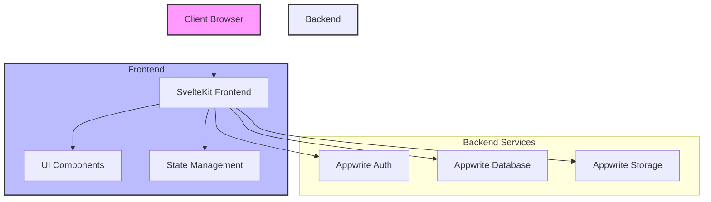
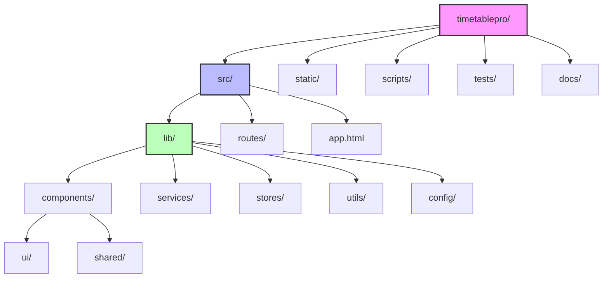

# TimetablePro

A modern school timetable management system built with SvelteKit and Appwrite Cloud. This application provides a comprehensive solution for managing school schedules, room allocations, and teacher availability.

## Features

- 🔐 **User Authentication**
  - Secure login and registration
  - Role-based access control (Admin, Teacher, Student)
  - Profile management with avatar support

- 📅 **Schedule Management**
  - Interactive timetable view
  - Conflict detection for room and teacher bookings
  - Drag-and-drop schedule creation (coming soon)
  - Automatic schedule generation (coming soon)

- 🏫 **Room Management**
  - Room capacity tracking
  - Room type categorization
  - Building-wise organization
  - Advanced filtering and search

- 👩‍🏫 **Teacher Availability**
  - Weekly availability settings
  - Automatic conflict prevention
  - Visual availability calendar

- 🎨 **Modern UI/UX**
  - Responsive design
  - Dark mode support (coming soon)
  - Accessible components using shadcn/ui
  - Beautiful animations and transitions

## Tech Stack

- **Frontend**: SvelteKit
- **Backend**: Appwrite Cloud
- **Styling**: Tailwind CSS
- **UI Components**: shadcn-svelte
- **Type Safety**: TypeScript
- **Authentication**: Appwrite Auth
- **Database**: Appwrite Database
- **Storage**: Appwrite Storage

## System Architecture



## Directory Structure



## Prerequisites

- Node.js (v16 or higher)
- Yarn package manager
- Appwrite Cloud account

## Environment Setup

Create a `.env` file in the root directory with the following variables:

```env
PUBLIC_APPWRITE_PROJECT_ID=your-project-id
PUBLIC_APPWRITE_ENDPOINT=https://cloud.appwrite.io/v1
APPWRITE_API_KEY=your-api-key
```

## Installation

1. Clone the repository:
   ```bash
   git clone https://github.com/yourusername/timetablepro.git
   cd timetablepro
   ```

2. Install dependencies:
   ```bash
   yarn install
   ```

3. Initialize Appwrite collections and buckets:
   ```bash
   yarn init-db
   ```

4. Start the development server:
   ```bash
   yarn dev
   ```

## Project Structure

```
timetablepro/
├── src/
│   ├── lib/
│   │   ├── components/     # Reusable UI components
│   │   ├── services/       # API and business logic
│   │   ├── stores/         # State management
│   │   ├── utils/          # Helper functions
│   │   └── config/         # Configuration files
│   ├── routes/             # SvelteKit routes/pages
│   └── app.html           # HTML template
├── static/                 # Static assets
├── scripts/               # Setup and utility scripts
├── tests/                 # Test files
└── docs/                  # Additional documentation
```

## Available Scripts

- `yarn dev` - Start development server
- `yarn build` - Build for production
- `yarn preview` - Preview production build
- `yarn test` - Run tests
- `yarn lint` - Check code style
- `yarn format` - Format code
- `yarn init-db` - Initialize Appwrite database

## Role-Based Access

- **Admin**
  - Manage all schedules
  - Manage rooms
  - View system statistics
  - Access all features

- **Teacher**
  - View assigned schedules
  - Set availability
  - Update profile

- **Student**
  - View class schedules
  - View room information

## Contributing

1. Fork the repository
2. Create your feature branch (`git checkout -b feature/AmazingFeature`)
3. Commit your changes (`git commit -m 'Add some AmazingFeature'`)
4. Push to the branch (`git push origin feature/AmazingFeature`)
5. Open a Pull Request

## Documentation

- [API Documentation](./docs/API.md)
- [Development Guide](./docs/DEVELOPMENT.md)
- [Deployment Guide](./docs/DEPLOYMENT.md)
- [User Guide](./docs/USER_GUIDE.md)

## License

This project is licensed under the MIT License - see the [LICENSE](LICENSE) file for details.

## Support

For support, email support@timetablepro.com or join our Slack channel.
