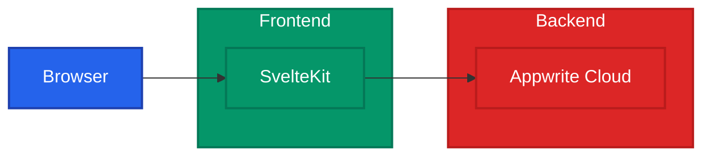

# TimetablePro

A modern school timetable management system built with SvelteKit and Appwrite Cloud.

## Table of Contents

- [Features](#features)
- [Tech Stack](#tech-stack)
- [Getting Started](#getting-started)
- [Development](#development)
- [Documentation](#documentation)

## Features

- 🔐 **Authentication & Authorization** - Secure login with role-based access (Admin, Teacher, Student)
- 📅 **Schedule Management** - Interactive timetable with conflict detection
- 🏫 **Room Management** - Track room capacity, type, and availability
- 👩‍🏫 **Teacher Availability** - Manage teacher schedules and prevent conflicts
- 🎨 **Modern UI/UX** - Responsive design with shadcn/ui components

## Tech Stack

- Frontend: SvelteKit, TypeScript, Tailwind CSS, shadcn-svelte
- Backend: Appwrite Cloud (Auth, Database, Storage)

## System Overview



## Getting Started

1. Prerequisites:
   - Node.js (v16+)
   - Yarn
   - Appwrite Cloud account

2. Environment Setup:
   ```env
   PUBLIC_APPWRITE_PROJECT_ID=your-project-id
   PUBLIC_APPWRITE_ENDPOINT=https://cloud.appwrite.io/v1
   APPWRITE_API_KEY=your-api-key
   ```

3. Installation:
   ```bash
   git clone https://github.com/yourusername/timetablepro.git
   cd timetablepro
   yarn install
   yarn init-db
   yarn dev
   ```

## Development

Available Scripts:
- `yarn dev` - Development server
- `yarn build` - Production build
- `yarn test` - Run tests
- `yarn lint` - Check code style
- `yarn init-db` - Initialize database

## Documentation

- [User Guide](./docs/USER_GUIDE.md) - Usage instructions for all user roles
- [API Documentation](./docs/API.md) - API endpoints and data types
- [Development Guide](./docs/DEVELOPMENT.md) - Setup and contribution guidelines

## License

MIT License - see [LICENSE](LICENSE) file
