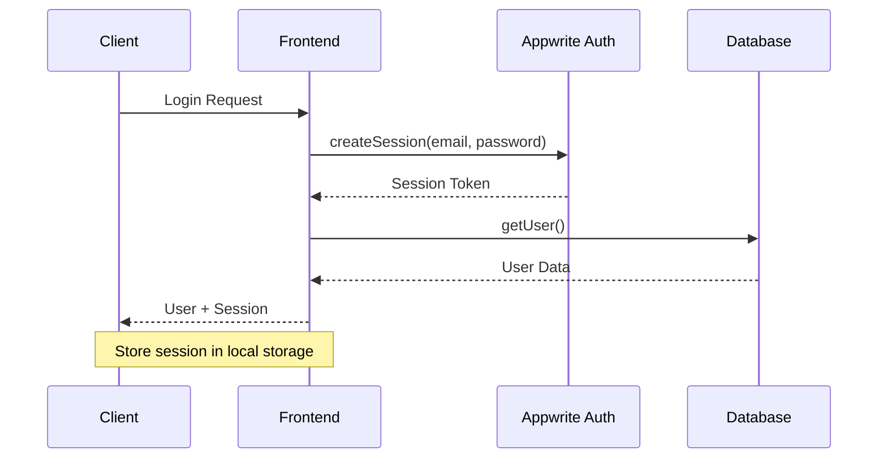
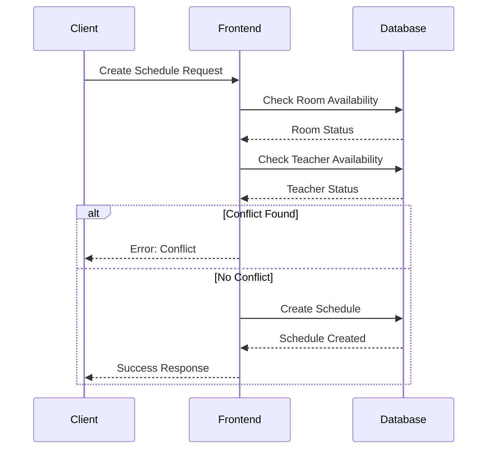

# TimetablePro API Documentation

This document provides detailed information about the TimetablePro API services and their usage.

## Table of Contents

- [Authentication](#authentication)
- [Schedule Management](#schedule-management)
- [Room Management](#room-management)
- [Availability Management](#availability-management)
- [User Management](#user-management)

## Authentication

Authentication is handled through Appwrite's authentication service.

### Login

```typescript
async function login(email: string, password: string): Promise<AppUser>
```

Authenticates a user and creates a new session.

**Parameters:**
- `email`: User's email address
- `password`: User's password

**Returns:**
- `AppUser`: User object with role information

### Register

```typescript
async function register(email: string, password: string, name: string): Promise<AppUser>
```

Creates a new user account.

**Parameters:**
- `email`: User's email address
- `password`: User's password
- `name`: User's full name

**Returns:**
- `AppUser`: Created user object

### Logout

```typescript
async function logout(): Promise<void>
```

Deletes the current session and logs out the user.

## Schedule Management

### Get Schedules

```typescript
async function getSchedules(filters?: {
    teacherId?: string;
    roomId?: string;
    dayOfWeek?: string;
}): Promise<Schedule[]>
```

Retrieves schedules based on optional filters.

**Parameters:**
- `filters.teacherId`: Filter by teacher ID
- `filters.roomId`: Filter by room ID
- `filters.dayOfWeek`: Filter by day of the week

**Returns:**
- Array of Schedule objects

### Create Schedule

```typescript
async function createSchedule(schedule: ScheduleData): Promise<Schedule>
```

Creates a new schedule entry.

**Parameters:**
- `schedule`: Schedule data object containing:
  - `subject`: Subject name
  - `teacherId`: Teacher's ID
  - `roomId`: Room ID
  - `dayOfWeek`: Day of the week
  - `startTime`: Start time (HH:mm)
  - `endTime`: End time (HH:mm)
  - `class`: Class identifier

**Returns:**
- Created Schedule object

### Update Schedule

```typescript
async function updateSchedule(
    scheduleId: string,
    schedule: Partial<ScheduleData>
): Promise<Schedule>
```

Updates an existing schedule.

**Parameters:**
- `scheduleId`: ID of the schedule to update
- `schedule`: Partial schedule data to update

**Returns:**
- Updated Schedule object

### Delete Schedule

```typescript
async function deleteSchedule(scheduleId: string): Promise<void>
```

Deletes a schedule entry.

**Parameters:**
- `scheduleId`: ID of the schedule to delete

## Room Management

### Get Rooms

```typescript
async function getRooms(filters?: {
    building?: string;
    type?: string;
}): Promise<Room[]>
```

Retrieves rooms based on optional filters.

**Parameters:**
- `filters.building`: Filter by building
- `filters.type`: Filter by room type

**Returns:**
- Array of Room objects

### Create Room

```typescript
async function createRoom(room: RoomData): Promise<Room>
```

Creates a new room.

**Parameters:**
- `room`: Room data object containing:
  - `name`: Room name
  - `capacity`: Room capacity
  - `type`: Room type
  - `building`: Building name

**Returns:**
- Created Room object

### Update Room

```typescript
async function updateRoom(
    roomId: string,
    room: Partial<RoomData>
): Promise<Room>
```

Updates an existing room.

**Parameters:**
- `roomId`: ID of the room to update
- `room`: Partial room data to update

**Returns:**
- Updated Room object

### Delete Room

```typescript
async function deleteRoom(roomId: string): Promise<void>
```

Deletes a room.

**Parameters:**
- `roomId`: ID of the room to delete

## Availability Management

### Get Teacher Availability

```typescript
async function getTeacherAvailability(teacherId: string): Promise<Availability[]>
```

Retrieves availability settings for a teacher.

**Parameters:**
- `teacherId`: Teacher's ID

**Returns:**
- Array of Availability objects

### Set Availability

```typescript
async function setAvailability(availability: AvailabilityData): Promise<Availability>
```

Sets or updates a teacher's availability.

**Parameters:**
- `availability`: Availability data object containing:
  - `teacherId`: Teacher's ID
  - `dayOfWeek`: Day of the week
  - `availableSlots`: Array of available time slots

**Returns:**
- Created/Updated Availability object

## User Management

### Update Profile

```typescript
async function updateProfile(
    name: string,
    avatarFile?: File
): Promise<AppUser>
```

Updates a user's profile information.

**Parameters:**
- `name`: New name for the user
- `avatarFile`: Optional avatar image file

**Returns:**
- Updated AppUser object

## Data Types

### AppUser

```typescript
interface AppUser extends Models.User<Models.Preferences> {
    role: 'admin' | 'teacher' | 'student';
    avatarUrl?: string;
}
```

### Schedule

```typescript
interface Schedule extends Models.Document {
    subject: string;
    teacherId: string;
    roomId: string;
    dayOfWeek: string;
    startTime: string;
    endTime: string;
    class: string;
}
```

### Room

```typescript
interface Room extends Models.Document {
    name: string;
    capacity: number;
    type: string;
    building: string;
}
```

### Availability

```typescript
interface Availability extends Models.Document {
    teacherId: string;
    dayOfWeek: string;
    availableSlots: string[];
}
```

## Error Handling

All API functions may throw errors that should be handled appropriately. Common error scenarios include:

- Authentication errors
- Permission errors
- Validation errors
- Network errors
- Resource not found errors

Example error handling:

```typescript
try {
    const schedule = await createSchedule(scheduleData);
} catch (error) {
    if (error instanceof Error) {
        console.error('Error creating schedule:', error.message);
    }
    // Handle error appropriately
}
```

## Authentication Flow



## Schedule Creation Flow

