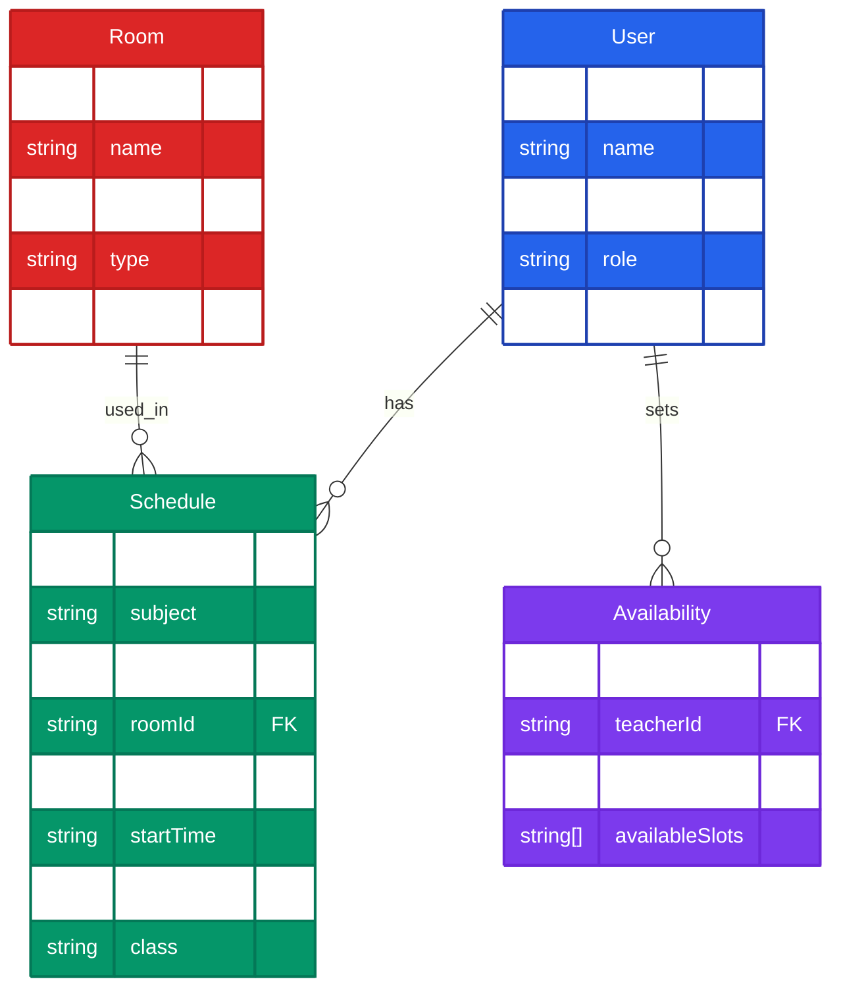
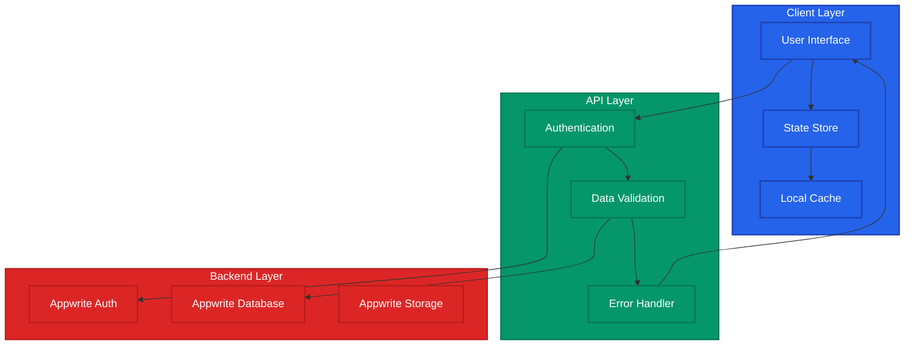
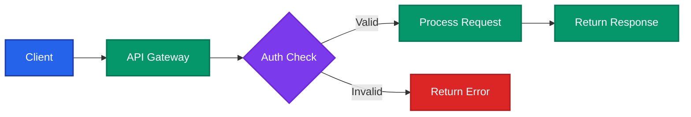
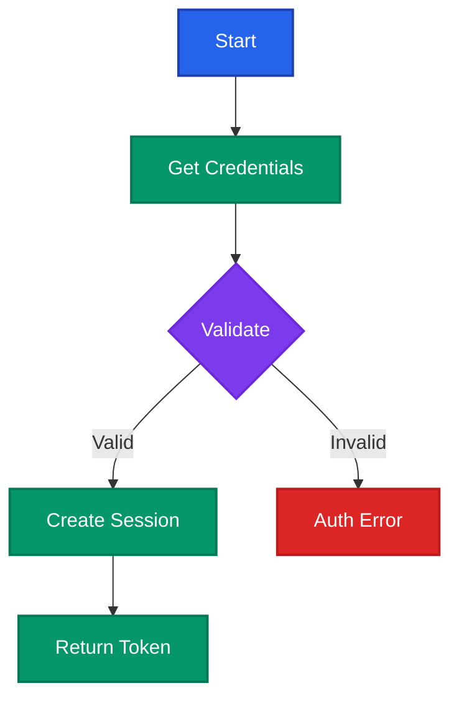
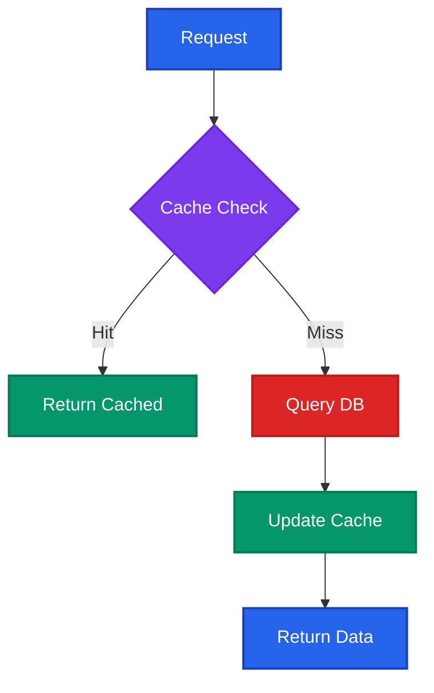
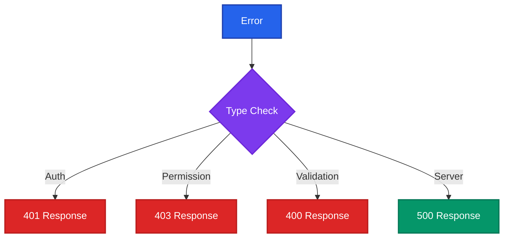

# TimetablePro API Documentation

## Authentication

```typescript
login(email: string, password: string): Promise<AppUser>
register(email: string, password: string, name: string): Promise<AppUser>
logout(): Promise<void>
```

## Schedule Management

```typescript
getSchedules(filters?: {
    teacherId?: string;
    roomId?: string;
    dayOfWeek?: string;
}): Promise<Schedule[]>

createSchedule(schedule: {
    subject: string;
    teacherId: string;
    roomId: string;
    dayOfWeek: string;
    startTime: string;
    endTime: string;
    class: string;
}): Promise<Schedule>

updateSchedule(scheduleId: string, schedule: Partial<Schedule>): Promise<Schedule>
deleteSchedule(scheduleId: string): Promise<void>
```

## Room Management

```typescript
getRooms(filters?: {
    building?: string;
    type?: string;
}): Promise<Room[]>

createRoom(room: {
    name: string;
    capacity: number;
    type: string;
    building: string;
}): Promise<Room>

updateRoom(roomId: string, room: Partial<Room>): Promise<Room>
deleteRoom(roomId: string): Promise<void>
```

## Availability Management

```typescript
getTeacherAvailability(teacherId: string): Promise<Availability[]>
setAvailability(availability: {
    teacherId: string;
    dayOfWeek: string;
    availableSlots: TimeSlot[];
}): Promise<Availability>
```

## User Management

```typescript
updateProfile(name: string, avatarFile?: File): Promise<AppUser>
```

## Data Types

```typescript
interface AppUser {
    id: string;
    name: string;
    email: string;
    role: 'admin' | 'teacher' | 'student';
    avatarUrl?: string;
}

interface Schedule {
    id: string;
    subject: string;
    teacherId: string;
    roomId: string;
    dayOfWeek: string;
    startTime: string;
    endTime: string;
    class: string;
}

interface Room {
    id: string;
    name: string;
    capacity: number;
    type: string;
    building: string;
}

interface Availability {
    id: string;
    teacherId: string;
    dayOfWeek: string;
    availableSlots: TimeSlot[];
}

interface TimeSlot {
    start: string; // HH:mm format
    end: string;   // HH:mm format
}
```

## Error Handling

All API functions may throw errors that should be handled appropriately. Common error scenarios include:

- Authentication errors
- Permission errors
- Validation errors
- Network errors
- Resource not found errors

Example error handling:

```typescript
try {
    const schedule = await createSchedule(scheduleData);
} catch (error) {
    if (error instanceof Error) {
        console.error('Error creating schedule:', error.message);
    }
    // Handle error appropriately
}
```

## Authentication Flow

```mermaid
sequenceDiagram
    participant C as Client
    participant F as Frontend
    participant A as Appwrite Auth
    participant D as Database
    
    C->>F: Login Request
    F->>A: createSession(email, password)
    A-->>F: Session Token
    F->>D: getUser()
    D-->>F: User Data
    F-->>C: User + Session

    Note over C,F: Store session in local storage

    %% Strong, accessible colors
    style C fill:#2563eb,color:#ffffff,stroke:#1e40af,stroke-width:2px
    style F fill:#059669,color:#ffffff,stroke:#047857,stroke-width:2px
    style A fill:#dc2626,color:#ffffff,stroke:#b91c1c,stroke-width:2px
    style D fill:#7c3aed,color:#ffffff,stroke:#6d28d9,stroke-width:2px
```

## Schedule Creation Flow

```mermaid
sequenceDiagram
    participant C as Client
    participant F as Frontend
    participant D as Database
    
    C->>F: Create Schedule Request
    F->>D: Check Room Availability
    D-->>F: Room Status
    F->>D: Check Teacher Availability
    D-->>F: Teacher Status
    
    alt Conflict Found
        F-->>C: Error: Conflict
    else No Conflict
        F->>D: Create Schedule
        D-->>F: Schedule Created
        F-->>C: Success Response
    end

    %% Strong, accessible colors
    style C fill:#2563eb,color:#ffffff,stroke:#1e40af,stroke-width:2px
    style F fill:#059669,color:#ffffff,stroke:#047857,stroke-width:2px
    style D fill:#dc2626,color:#ffffff,stroke:#b91c1c,stroke-width:2px
```

## Database Schema



## Data Flow



## Error Handling Flow

```mermaid
stateDiagram-v2
    [*] --> Request
    Request --> Validation
    
    state Validation {
        [*] --> CheckInput
        CheckInput --> ValidInput: Valid
        CheckInput --> InvalidInput: Invalid
        InvalidInput --> ReturnError
        ValidInput --> ProcessRequest
    }
    
    Validation --> ProcessRequest: Valid
    Validation --> ReturnError: Invalid
    
    ProcessRequest --> Success
    ProcessRequest --> APIError
    
    APIError --> RetryLogic
    RetryLogic --> ProcessRequest: Retry
    RetryLogic --> ReturnError: Max Retries
    
    Success --> [*]
    ReturnError --> [*]

    %% Strong, accessible colors
    classDef default fill:#2563eb,color:#ffffff,stroke:#1e40af,stroke-width:2px
    classDef process fill:#059669,color:#ffffff,stroke:#047857,stroke-width:2px
    classDef error fill:#dc2626,color:#ffffff,stroke:#b91c1c,stroke-width:2px
    classDef success fill:#059669,color:#ffffff,stroke:#047857,stroke-width:2px
```

## API Rate Limiting

```mermaid
flowchart TD
    subgraph Rate Limiter
        Request[API Request]
        Check[Check Rate Limit]
        Allow[Allow Request]
        Block[Block Request]
        
        Request --> Check
        Check --> Allow: Under Limit
        Check --> Block: Over Limit
        Allow --> UpdateCount[Update Counter]
        Block --> ReturnError[Return 429 Error]
    end
    
    %% Strong, accessible colors
    classDef default fill:#2563eb,color:#ffffff,stroke:#1e40af,stroke-width:2px
    classDef success fill:#059669,color:#ffffff,stroke:#047857,stroke-width:2px
    classDef error fill:#dc2626,color:#ffffff,stroke:#b91c1c,stroke-width:2px
    
    class Request,Check default
    class Allow,UpdateCount success
    class Block,ReturnError error
    
    style Rate Limiter fill:#2563eb,color:#ffffff,stroke:#1e40af,stroke-width:2px
```

## API Request Flow



## Authentication Process



## Data Access Flow



## Error Handling

