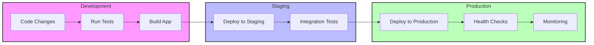

# TimetablePro Deployment Guide

This guide provides detailed instructions for deploying TimetablePro to various environments.

## Table of Contents

- [Prerequisites](#prerequisites)
- [Environment Setup](#environment-setup)
- [Deployment Options](#deployment-options)
  - [Vercel Deployment](#vercel-deployment)
  - [Docker Deployment](#docker-deployment)
  - [Manual Deployment](#manual-deployment)
- [Database Setup](#database-setup)
- [Monitoring and Maintenance](#monitoring-and-maintenance)
- [Troubleshooting](#troubleshooting)
- [Deployment Architecture](#deployment-architecture)
- [CI/CD Workflow](#ci-cd-workflow)

## Prerequisites

Before deploying, ensure you have:

1. Node.js v16 or higher installed
2. Yarn package manager
3. Appwrite Cloud account
4. Git installed
5. Docker (optional, for containerized deployment)

## Environment Setup

### 1. Environment Variables

Create a `.env` file with the following variables:

```env
# Appwrite Configuration
PUBLIC_APPWRITE_PROJECT_ID=your-project-id
PUBLIC_APPWRITE_ENDPOINT=https://cloud.appwrite.io/v1
APPWRITE_API_KEY=your-api-key

# Application Configuration
PUBLIC_APP_URL=https://your-domain.com
NODE_ENV=production
```

### 2. Build Configuration

Update `svelte.config.js` for production:

```javascript
const config = {
  kit: {
    adapter: adapter({
      pages: 'build',
      assets: 'build',
      fallback: 'index.html',
      precompress: true
    })
  }
};
```

## Deployment Options

### Vercel Deployment

1. Push your code to GitHub

2. Connect your repository to Vercel:
   - Go to vercel.com
   - Create a new project
   - Select your repository
   - Configure build settings:
     ```
     Build Command: yarn build
     Output Directory: build
     Install Command: yarn install
     ```

3. Configure environment variables in Vercel dashboard

4. Deploy:
   ```bash
   vercel --prod
   ```

### Docker Deployment

1. Build the Docker image:
   ```bash
   docker build -t timetablepro .
   ```

2. Run the container:
   ```bash
   docker run -p 3000:3000 \
     -e PUBLIC_APPWRITE_PROJECT_ID=your-project-id \
     -e PUBLIC_APPWRITE_ENDPOINT=https://cloud.appwrite.io/v1 \
     -e APPWRITE_API_KEY=your-api-key \
     timetablepro
   ```

### Manual Deployment

1. Build the application:
   ```bash
   yarn build
   ```

2. Set up a Node.js server:
   ```javascript
   // server.js
   const express = require('express');
   const compression = require('compression');
   const path = require('path');

   const app = express();
   app.use(compression());
   app.use(express.static('build'));

   app.get('*', (req, res) => {
     res.sendFile(path.resolve(__dirname, 'build', 'index.html'));
   });

   const PORT = process.env.PORT || 3000;
   app.listen(PORT, () => {
     console.log(`Server running on port ${PORT}`);
   });
   ```

3. Start the server:
   ```bash
   node server.js
   ```

## Database Setup

### Appwrite Setup

1. Create Collections:

```bash
yarn init-db
```

This script will:
- Create necessary collections
- Set up indexes
- Configure permissions
- Create admin team

2. Verify Collections:
   - Check users collection
   - Check rooms collection
   - Check schedules collection
   - Check availability collection

3. Set up Storage:
   - Create avatar bucket
   - Configure permissions

## Monitoring and Maintenance

### Health Checks

Implement health check endpoint:

```typescript
// src/routes/health/+server.ts
import type { RequestHandler } from '@sveltejs/kit';
import { databases } from '$lib/config/appwrite';

export const GET: RequestHandler = async () => {
  try {
    await databases.list(); // Test database connection
    return new Response('OK', { status: 200 });
  } catch (error) {
    return new Response('Error', { status: 500 });
  }
};
```

### Logging

Set up logging with Winston:

```typescript
// src/lib/utils/logger.ts
import winston from 'winston';

export const logger = winston.createLogger({
  level: 'info',
  format: winston.format.json(),
  transports: [
    new winston.transports.File({ filename: 'error.log', level: 'error' }),
    new winston.transports.File({ filename: 'combined.log' })
  ]
});
```

### Backup Strategy

1. Database Backups:
   ```bash
   # Backup script
   appwrite backup create \
     --project-id your-project-id \
     --api-key your-api-key
   ```

2. Schedule regular backups:
   ```bash
   # Add to crontab
   0 0 * * * /path/to/backup-script.sh
   ```

## Performance Optimization

### 1. Enable Compression

```javascript
// server.js
app.use(compression());
```

### 2. Cache Control Headers

```javascript
app.use(express.static('build', {
  maxAge: '1y',
  etag: false
}));
```

### 3. CDN Setup

Configure CDN for static assets:

```javascript
const PUBLIC_CDN_URL = process.env.PUBLIC_CDN_URL;

app.use((req, res, next) => {
  res.setHeader('Cache-Control', 'public, max-age=31536000');
  next();
});
```

## SSL Configuration

### 1. Generate SSL Certificate

```bash
certbot certonly --nginx -d yourdomain.com
```

### 2. Configure NGINX

```nginx
server {
    listen 443 ssl;
    server_name yourdomain.com;

    ssl_certificate /etc/letsencrypt/live/yourdomain.com/fullchain.pem;
    ssl_certificate_key /etc/letsencrypt/live/yourdomain.com/privkey.pem;

    location / {
        proxy_pass http://localhost:3000;
        proxy_set_header Host $host;
        proxy_set_header X-Real-IP $remote_addr;
    }
}
```

## Troubleshooting

### Common Issues

1. Build Failures
   ```bash
   # Clear build cache
   rm -rf .svelte-kit
   yarn build
   ```

2. Database Connection Issues
   ```bash
   # Check Appwrite connection
   curl -X GET "https://cloud.appwrite.io/v1/health"
   ```

3. Memory Issues
   ```bash
   # Increase Node.js memory limit
   NODE_OPTIONS=--max_old_space_size=4096 yarn build
   ```

### Monitoring Tools

1. Set up Sentry:
   ```typescript
   import * as Sentry from '@sentry/node';

   Sentry.init({
     dsn: 'your-sentry-dsn',
     environment: process.env.NODE_ENV
   });
   ```

2. Configure logging:
   ```typescript
   logger.info('Application started', {
     timestamp: new Date().toISOString()
   });
   ```

## Security Checklist

- [ ] SSL certificate installed
- [ ] Environment variables secured
- [ ] API keys rotated
- [ ] Rate limiting configured
- [ ] CORS settings verified
- [ ] Security headers implemented
- [ ] Input validation added
- [ ] XSS protection enabled
- [ ] CSRF protection enabled

## Maintenance Schedule

1. Weekly Tasks:
   - Check error logs
   - Monitor performance metrics
   - Update dependencies

2. Monthly Tasks:
   - Rotate API keys
   - Review security settings
   - Perform database cleanup

3. Quarterly Tasks:
   - Update SSL certificates
   - Review and update documentation
   - Perform load testing

## Deployment Architecture

```mermaid
graph TD
    subgraph Client Layer
        Browser[Web Browser]
        Mobile[Mobile Browser]
    end
    
    subgraph CDN Layer
        CDN[Content Delivery Network]
    end
    
    subgraph Application Layer
        LB[Load Balancer]
        App1[App Server 1]
        App2[App Server 2]
        Cache[Redis Cache]
    end
    
    subgraph Backend Services
        Auth[Appwrite Auth]
        DB[Appwrite Database]
        Storage[Appwrite Storage]
    end
    
    Browser --> CDN
    Mobile --> CDN
    CDN --> LB
    LB --> App1
    LB --> App2
    App1 --> Cache
    App2 --> Cache
    App1 --> Backend Services
    App2 --> Backend Services
    
    style Client Layer fill:#f9f,stroke:#333,stroke-width:2px
    style CDN Layer fill:#bbf,stroke:#333,stroke-width:2px
    style Application Layer fill:#bfb,stroke:#333,stroke-width:2px
    style Backend Services fill:#fbb,stroke:#333,stroke-width:2px
```

## CI/CD Workflow

