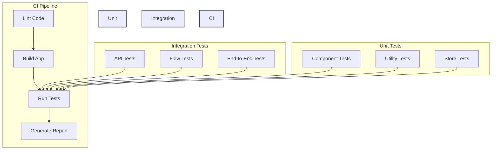
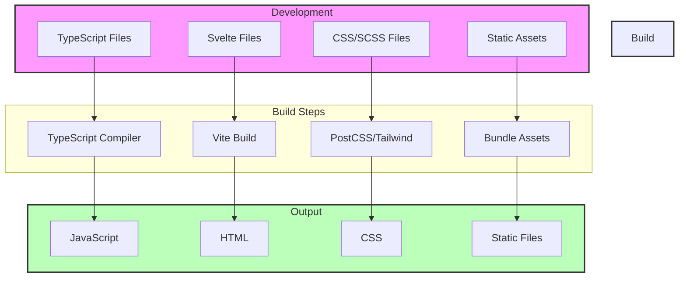
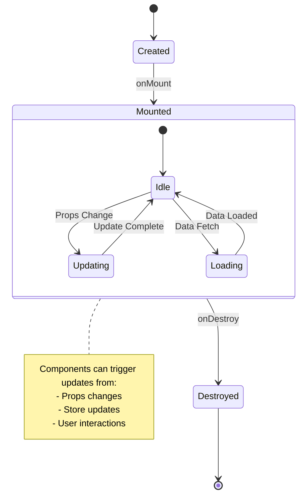
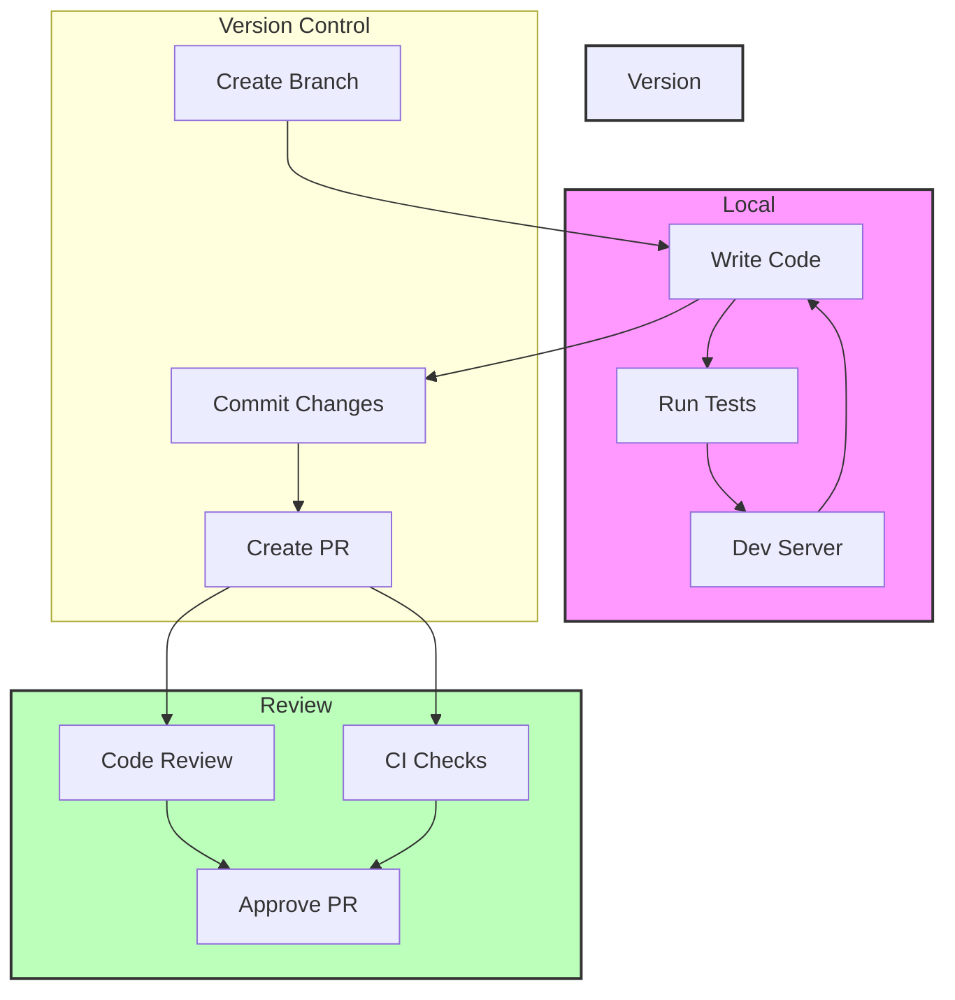
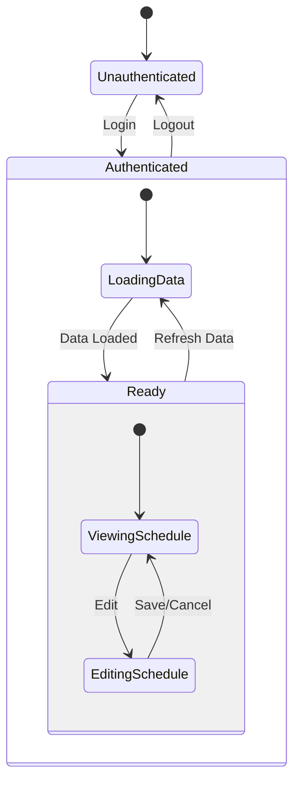

# TimetablePro Development Guide

This guide provides detailed information for developers working on the TimetablePro project.

## Table of Contents

- [Development Setup](#development-setup)
- [Project Structure](#project-structure)
- [Code Style](#code-style)
- [State Management](#state-management)
- [Component Guidelines](#component-guidelines)
- [Testing](#testing)
- [Performance Optimization](#performance-optimization)
- [Security Guidelines](#security-guidelines)
- [Component Architecture](#component-architecture)
- [State Management Flow](#state-management-flow)

## Development Setup

### Prerequisites

1. Install Node.js (v16 or higher)
2. Install Yarn package manager
3. Create an Appwrite Cloud account
4. Install VS Code with recommended extensions:
   - Svelte for VS Code
   - Tailwind CSS IntelliSense
   - ESLint
   - Prettier

### Local Development Environment

1. Clone the repository:
   ```bash
   git clone https://github.com/yourusername/timetablepro.git
   cd timetablepro
   ```

2. Install dependencies:
   ```bash
   yarn install
   ```

3. Set up environment variables:
   ```bash
   cp .env.example .env
   ```
   Update the `.env` file with your Appwrite credentials.

4. Initialize the database:
   ```bash
   yarn init-db
   ```

5. Start the development server:
   ```bash
   yarn dev
   ```

### VS Code Configuration

Create `.vscode/settings.json`:
```json
{
  "editor.formatOnSave": true,
  "editor.defaultFormatter": "esbenp.prettier-vscode",
  "editor.codeActionsOnSave": {
    "source.fixAll.eslint": true
  },
  "typescript.tsdk": "node_modules/typescript/lib"
}
```

## Project Structure

```
timetablepro/
├── src/
│   ├── lib/
│   │   ├── components/     # Reusable UI components
│   │   │   ├── ui/        # shadcn/ui components
│   │   │   └── shared/    # Custom shared components
│   │   ├── services/      # API and business logic
│   │   ├── stores/        # Svelte stores
│   │   ├── utils/         # Helper functions
│   │   └── config/        # Configuration files
│   ├── routes/            # SvelteKit routes/pages
│   └── app.html          # HTML template
├── static/               # Static assets
├── scripts/             # Setup and utility scripts
├── tests/               # Test files
└── docs/               # Documentation
```

### Key Directories

- `src/lib/components/ui/`: shadcn/ui components with consistent styling
- `src/lib/components/shared/`: Custom reusable components
- `src/lib/services/`: API services for data management
- `src/lib/stores/`: Svelte stores for state management
- `src/routes/`: SvelteKit routes and page components

## Code Style

### TypeScript Guidelines

- Use TypeScript for all new code
- Define interfaces for all data structures
- Use strict type checking
- Avoid using `any` type

Example:
```typescript
interface User {
  id: string;
  name: string;
  email: string;
  role: 'admin' | 'teacher' | 'student';
}

function getUser(id: string): Promise<User> {
  // Implementation
}
```

### Component Guidelines

- Use TypeScript for components
- Define prop types using TypeScript interfaces
- Use SvelteKit's built-in types

Example:
```svelte
<script lang="ts">
  interface $$Props {
    title: string;
    description?: string;
  }

  export let title: $$Props['title'];
  export let description: $$Props['description'] = '';
</script>
```

### CSS Guidelines

- Use Tailwind CSS for styling
- Follow BEM naming convention for custom CSS
- Keep component styles modular

Example:
```svelte
<div class="card">
  <h2 class="card__title">{title}</h2>
  <p class="card__description">{description}</p>
</div>

<style>
  .card {
    @apply p-4 rounded-lg shadow-md;
  }
  .card__title {
    @apply text-xl font-bold mb-2;
  }
  .card__description {
    @apply text-gray-600;
  }
</style>
```

## State Management

### Svelte Stores

Use Svelte stores for global state management:

```typescript
// src/lib/stores/auth.ts
import { writable } from 'svelte/store';

interface AuthState {
  user: User | null;
  loading: boolean;
  error: string | null;
}

function createAuthStore() {
  const { subscribe, set, update } = writable<AuthState>({
    user: null,
    loading: false,
    error: null
  });

  return {
    subscribe,
    setUser: (user: User) => update(state => ({ ...state, user })),
    // ... other methods
  };
}

export const authStore = createAuthStore();
```

### Store Usage

```svelte
<script>
  import { authStore } from '$lib/stores/auth';
</script>

{#if $authStore.user}
  <h1>Welcome, {$authStore.user.name}!</h1>
{/if}
```

## Testing

### Unit Testing

Use Vitest for unit testing:

```typescript
// src/lib/utils/time.test.ts
import { describe, it, expect } from 'vitest';
import { formatTime } from './time';

describe('formatTime', () => {
  it('formats time correctly', () => {
    expect(formatTime('09:00')).toBe('9:00 AM');
    expect(formatTime('13:00')).toBe('1:00 PM');
  });
});
```

### Component Testing

Use Svelte Testing Library for component testing:

```typescript
import { render, fireEvent } from '@testing-library/svelte';
import Button from './Button.svelte';

test('button triggers click event', async () => {
  const { getByText } = render(Button, { props: { label: 'Click me' } });
  const button = getByText('Click me');
  await fireEvent.click(button);
  // Add assertions
});
```

## Testing Flow



## Build Process



## Component Lifecycle



## Development Workflow



## Performance Optimization

### Code Splitting

- Use dynamic imports for route-level code splitting
- Lazy load heavy components

```typescript
const AdminDashboard = () => import('./AdminDashboard.svelte');
```

### Image Optimization

- Use responsive images
- Optimize images before deployment
- Use appropriate image formats

```svelte

```

## Security Guidelines

### Authentication

- Always use HTTPS
- Implement proper session management
- Use secure password hashing

### Data Validation

- Validate all user inputs
- Sanitize data before displaying
- Use parameterized queries

### API Security

- Implement rate limiting
- Use proper CORS settings
- Validate API tokens

## Deployment

### Build Process

```bash
# Build for production
yarn build

# Preview production build
yarn preview
```

### Environment Variables

Required environment variables for production:
```env
PUBLIC_APPWRITE_PROJECT_ID=your-project-id
PUBLIC_APPWRITE_ENDPOINT=https://cloud.appwrite.io/v1
APPWRITE_API_KEY=your-api-key
```

## Contributing

1. Create a new branch for your feature
2. Follow the code style guidelines
3. Write tests for new features
4. Update documentation
5. Submit a pull request

## Troubleshooting

Common issues and solutions:

### Build Errors

```bash
# Clear SvelteKit build cache
rm -rf .svelte-kit

# Reinstall dependencies
rm -rf node_modules
yarn install
```

### Development Server Issues

```bash
# Clear Vite cache
rm -rf node_modules/.vite

# Restart development server
yarn dev --force
```

## Component Architecture

```mermaid
graph TD
    subgraph Core Components
        Layout[Layout Component]
        Nav[Navigation]
        Auth[Auth Provider]
    end
    
    subgraph Feature Components
        Schedule[Schedule Manager]
        Room[Room Manager]
        Profile[Profile Manager]
    end
    
    subgraph UI Components
        Button[Button]
        Input[Input]
        Modal[Modal]
        Table[Table]
    end
    
    subgraph Shared Components
        Avatar[Avatar]
        Calendar[Calendar]
        TimeSlot[TimeSlot]
    end
    
    Layout --> Nav
    Layout --> Auth
    
    Schedule --> UI Components
    Room --> UI Components
    Profile --> UI Components
    
    Feature Components --> Shared Components
    
    style Core Components fill:#f9f,stroke:#333,stroke-width:2px
    style Feature Components fill:#bbf,stroke:#333,stroke-width:2px
    style UI Components fill:#bfb,stroke:#333,stroke-width:2px
    style Shared Components fill:#fbb,stroke:#333,stroke-width:2px
```

## State Management Flow

