# TimetablePro User Guide

Welcome to TimetablePro! This guide will help you understand how to use the system effectively based on your role.

## Table of Contents

- [Getting Started](#getting-started)
- [User Roles](#user-roles)
- [Common Features](#common-features)
- [Admin Guide](#admin-guide)
- [Teacher Guide](#teacher-guide)
- [Student Guide](#student-guide)
- [Troubleshooting](#troubleshooting)
- [User Workflows](#user-workflows)
- [Feature Interactions](#feature-interactions)
- [Notification System](#notification-system)
- [Mobile Interface Flow](#mobile-interface-flow)
- [Data Synchronization](#data-synchronization)
- [User Interaction Flow](#user-interaction-flow)
- [Permission Flow](#permission-flow)
- [Schedule Creation](#schedule-creation)
- [Navigation Structure](#navigation-structure)

## Getting Started

### Account Creation

1. Visit the TimetablePro website
2. Click "Register" in the top right corner
3. Fill in your details:
   - Full Name
   - Email Address
   - Password (minimum 8 characters)
4. Click "Create Account"

### First Login

1. After registration, log in with your email and password
2. Update your profile:
   - Add a profile picture (optional)
   - Verify your information
   - Set your preferences

## User Roles

### Admin
- Full system access
- Manage users, rooms, and schedules
- View system statistics
- Configure system settings

### Teacher
- View and manage assigned schedules
- Set availability preferences
- View room information
- Update profile

### Student
- View class schedules
- View room information
- Access personal timetable

## Common Features

### Navigation

The main navigation menu includes:
- Schedule
- Rooms
- Profile
- Additional options based on your role

### Profile Management

1. Click your profile picture or name
2. Select "Profile"
3. Update your information:
   - Change profile picture
   - Update name
   - View role and email

### Schedule View

The schedule view shows:
- Time slots (8:00 AM to 6:00 PM)
- Days of the week
- Class information
- Room assignments

## Admin Guide

### Dashboard

Access the admin dashboard to:
- View system statistics
- Monitor active users
- Track room usage
- Access quick actions

### Managing Rooms

1. Navigate to "Rooms"
2. Add new rooms:
   - Click "Add Room"
   - Enter room details:
     - Name
     - Capacity
     - Type
     - Building
3. Edit existing rooms:
   - Click "Edit" on any room card
   - Modify details
   - Save changes
4. Delete rooms:
   - Click "Delete" on the room card
   - Confirm deletion

### Managing Schedules

1. Navigate to "Schedule"
2. Create new schedules:
   - Click "Add Schedule"
   - Select:
     - Subject
     - Teacher
     - Room
     - Time slot
     - Class
3. Edit schedules:
   - Click on any schedule
   - Modify details
   - Save changes
4. Delete schedules:
   - Click "Delete" on the schedule
   - Confirm deletion

### System Configuration

1. Access Settings:
   - Configure email notifications
   - Set system preferences
   - Manage user roles
2. Monitor System Health:
   - View error logs
   - Check performance metrics
   - Monitor database status

## Teacher Guide

### Setting Availability

1. Navigate to "Availability"
2. Set your available time slots:
   - Click on time slots to toggle availability
   - Green indicates available
   - Gray indicates unavailable
3. Save your preferences

### Viewing Schedules

1. Navigate to "Schedule"
2. View your assigned classes:
   - Subject
   - Room
   - Time slot
   - Class
3. Filter view:
   - By day
   - By subject
   - By class

### Managing Classes

1. View class details:
   - Click on any scheduled class
   - See student count
   - Check room information
2. Report conflicts:
   - Click "Report Issue"
   - Describe the problem
   - Submit for admin review

## Student Guide

### Viewing Timetable

1. Navigate to "Schedule"
2. View your class schedule:
   - Subject
   - Teacher
   - Room
   - Time
3. Filter options:
   - By day
   - By subject

### Room Information

1. Navigate to "Rooms"
2. View room details:
   - Location
   - Capacity
   - Facilities
   - Current availability

## Mobile Usage

### Responsive Design

The application is fully responsive:
- Adapts to screen size
- Touch-friendly interface
- Optimized navigation

### Mobile Features

1. Quick Actions:
   - Swipe gestures
   - Touch-friendly buttons
   - Simplified navigation

2. Offline Access:
   - View cached schedules
   - Sync when online
   - Receive notifications

## Troubleshooting

### Common Issues

1. Login Problems:
   - Check email spelling
   - Reset password if forgotten
   - Contact admin if persists

2. Schedule Conflicts:
   - Check for double bookings
   - Verify room availability
   - Contact admin for resolution

3. Display Issues:
   - Clear browser cache
   - Try different browser
   - Check internet connection

### Getting Help

1. In-App Support:
   - Click "Help" icon
   - Browse FAQ section
   - Submit support ticket

2. Contact Support:
   - Email: support@timetablepro.com
   - Response within 24 hours
   - Include screenshots if possible

## Best Practices

### Schedule Management

1. Regular Updates:
   - Check schedule daily
   - Update availability weekly
   - Report conflicts promptly

2. Communication:
   - Use in-app messaging
   - Keep profile updated
   - Respond to notifications

### Data Security

1. Account Security:
   - Use strong passwords
   - Don't share credentials
   - Log out after use

2. Privacy:
   - Review privacy settings
   - Manage visible information
   - Report suspicious activity

## Keyboard Shortcuts

### Navigation
- `Alt + S`: Schedule view
- `Alt + R`: Rooms view
- `Alt + P`: Profile
- `Alt + H`: Help

### Schedule Management
- `Ctrl + N`: New schedule
- `Ctrl + E`: Edit selected
- `Del`: Delete selected
- `Ctrl + F`: Filter view

## Updates and Changes

Stay informed about:
- New features
- System updates
- Maintenance schedules
- Policy changes

Subscribe to notifications for:
- Schedule changes
- Room updates
- System announcements
- Important alerts

## User Workflows

### Admin Workflow

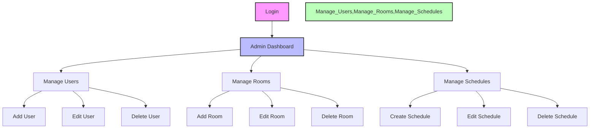

### Teacher Workflow

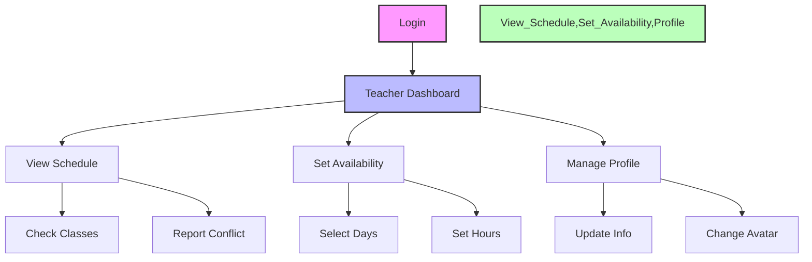

### Student Workflow

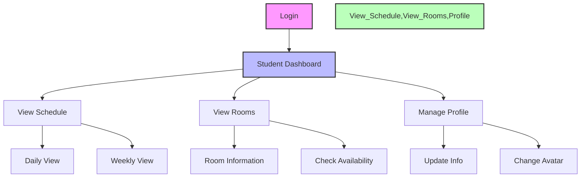

## Feature Interactions

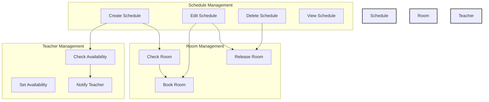

## Notification System

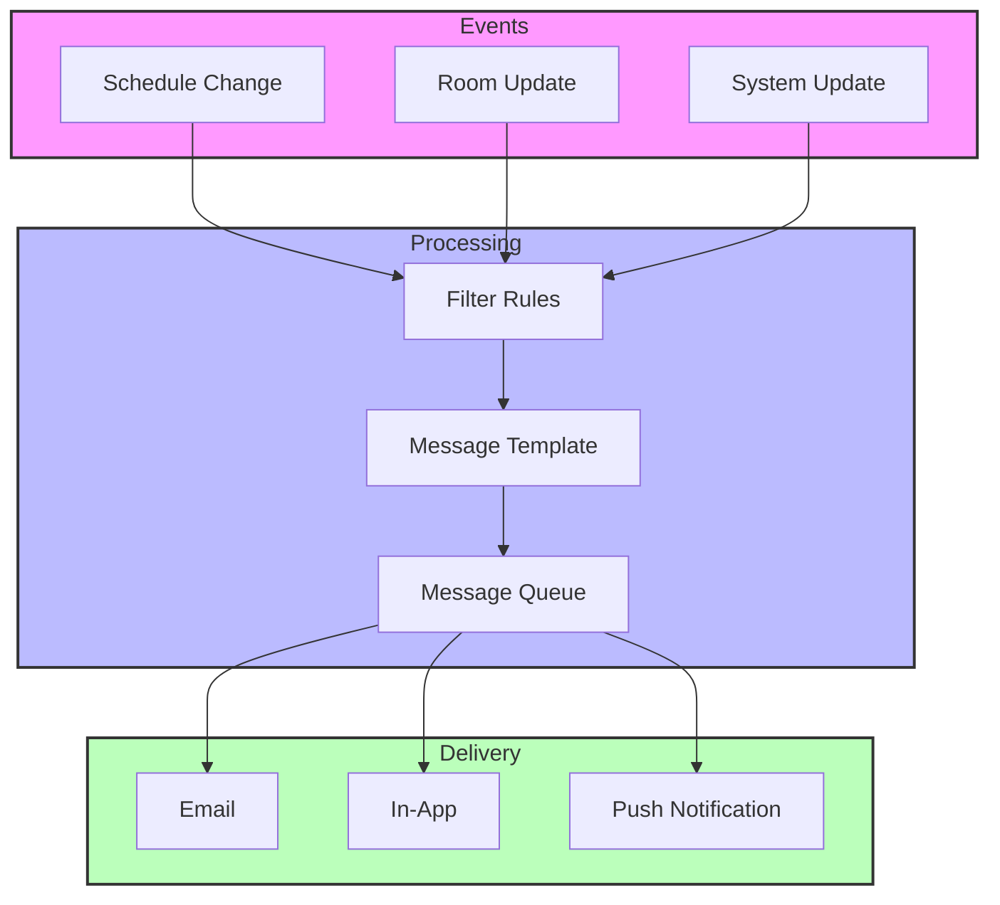

## Mobile Interface Flow

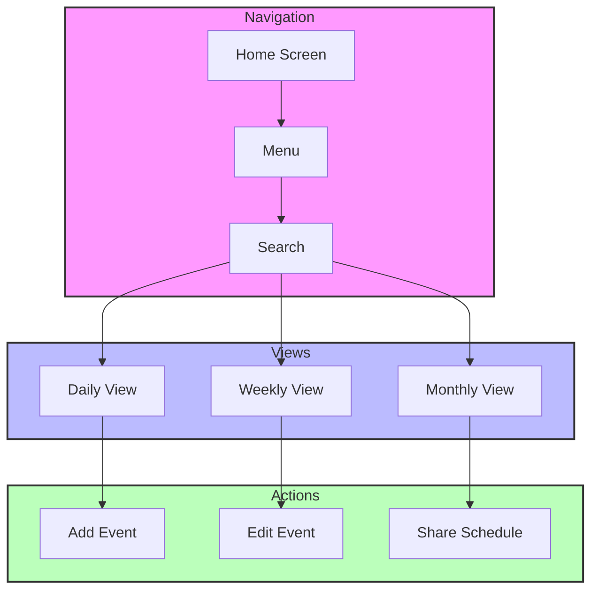

## Data Synchronization

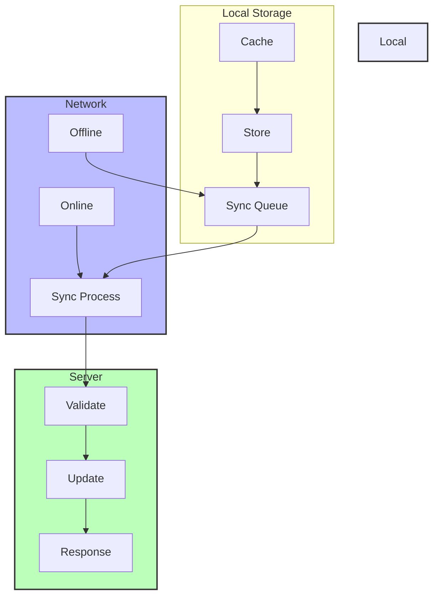

## User Interaction Flow

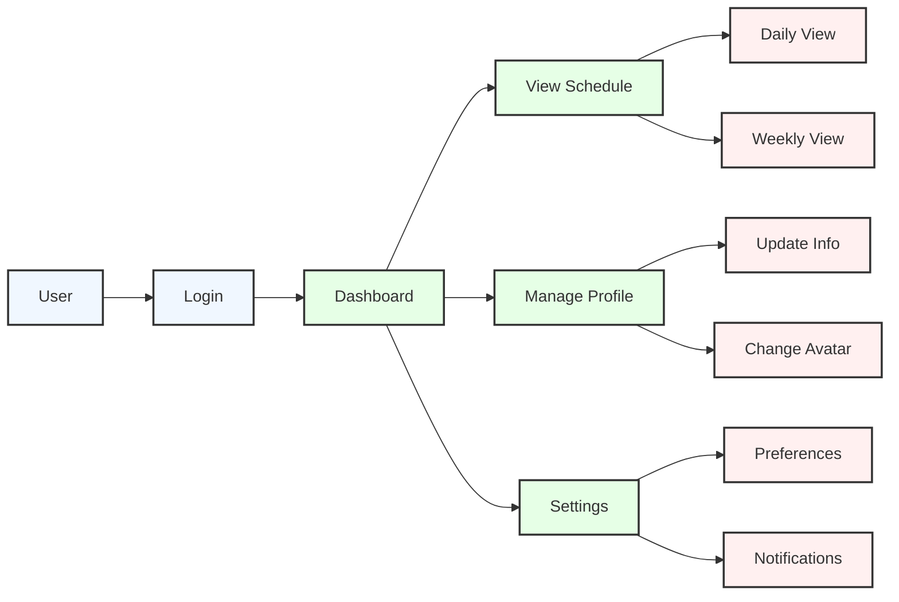

## Permission Flow

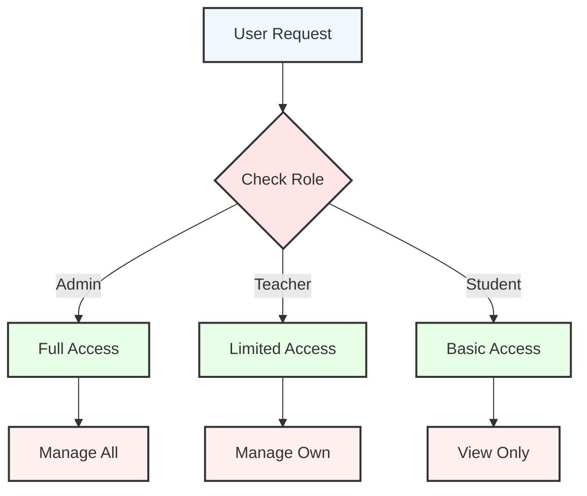

## Schedule Creation

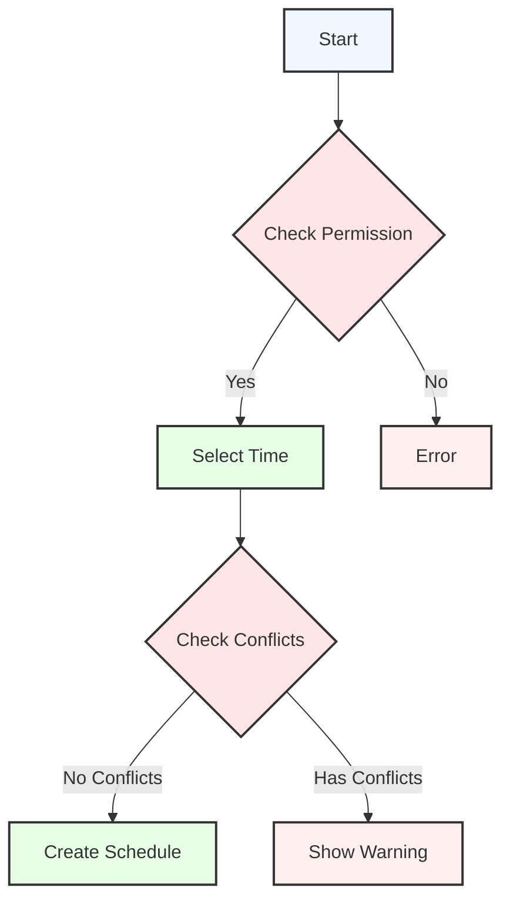

## Navigation Structure

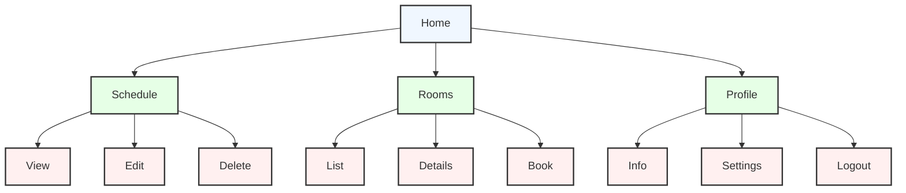